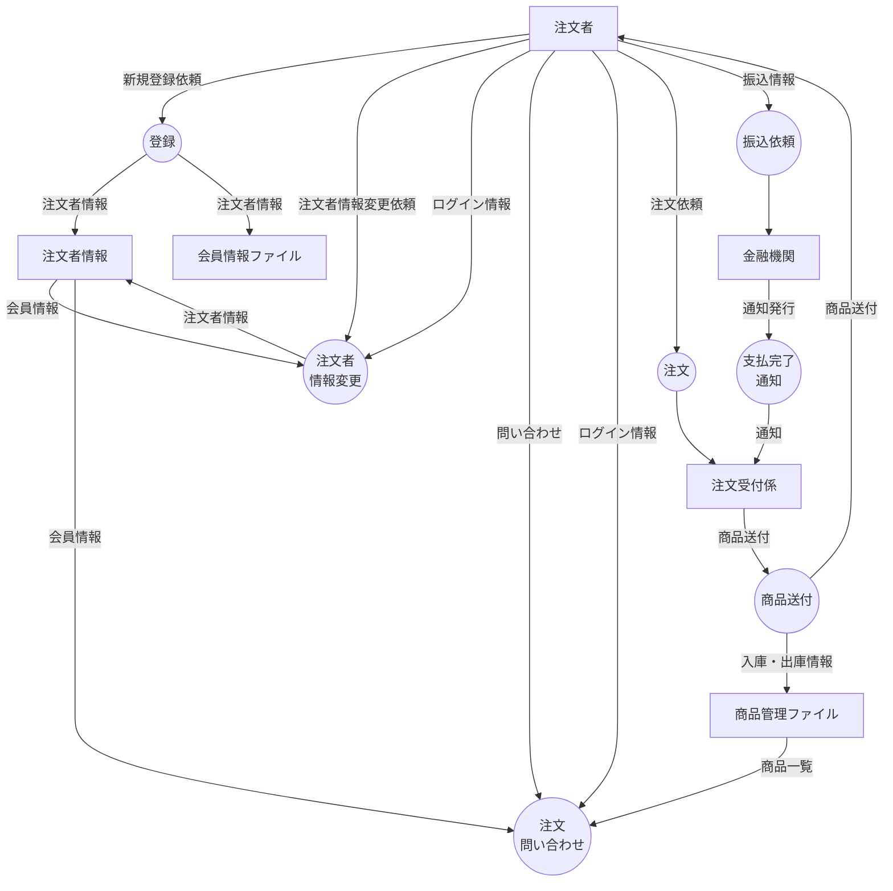

# 「ネット販売業務」の要求記述
- 注文者は，事前に注文者情報を新規に登録する必要がある．注文者情報とは，注文者の
氏名，住所，電話番号，初期パスワードをあわせたデータを指す．新規登録において，
会員管理係は，注文者情報を受け取ると，その注文者がすでに会員であるかどうかを検
査する．もし会員でなかったら，会員番号を発行し，注文者情報とともに会員情報ファ
イルに登録する．
- 注文者は，会員情報を変更することができる．その際，注文者は会員管理係にログイン
情報を送付して，会員認証に成功していなければならない．ログイン情報とは，注文者
の氏名とパスワードを合わせたデータを指す．
- 注文受付係は，注文者から受け取ったログイン情報により会員認証を行う．会員認証に
成功した注文者だけが，商品の検索や注文ができる．
- 注文受付係は，注文者から商品検索キーワードを受け取ると，商品管理ファイル内部の
商品より該当する商品を検索し，それら商品一覧を注文者に返送する．
- 注文者は，注文受付係に注文情報を送ることで，希望する商品を注文することができる．
- 注文受付係は，注文情報を受け取ると，その注文に関する振込完了通知メッセージの到
着を待つ．注文者が商品の購入代金を料金係に支払うと，料金係は支払完了通知メッセ
ージを注文受付係に送る．
- 注文受付係は，支払完了通知メッセージを受け取ると，それに該当する商品の発送情報
を商品管理係に送る．
- 商品管理係は，発送情報を受け取ると，倉庫係に発送依頼メッセージを送る．
- 倉庫係は，発送依頼メッセージを受け取ると，注文者に商品を送付する．
- 商品管理係は，倉庫係から商品管理情報を適時受け取り，商品管理ファイルに格納する．
商品管理情報には，取扱商品情報や，それらの商品の入庫情報および出庫情報が含まれ
る．

