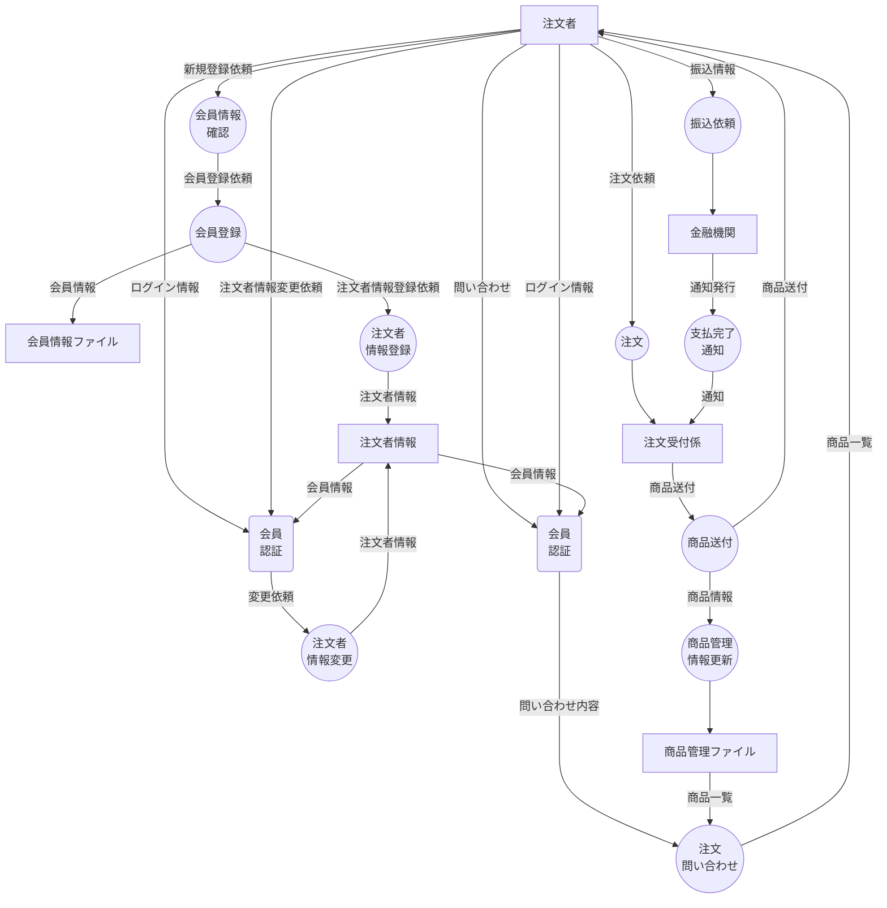

```mermaid
flowchart TD
    %% 外部実体
    orderer[注文者]
    bank[金融機関]
    orderReception[注文受付係]

    %% データ実体
    membershipManagement[|borders:tb|注文者情報]
    productData[|borders:tb|商品管理ファイル]
    memberData[|borders:tb|会員情報ファイル]

    %% プロセス
    isMember((会員情報\n確認))
    registerMember((会員登録))
    registerOrderer((注文者\n情報登録))

    authMember1(会員\n認証)
    authMember2(会員\n認証)

    changeInfo((注文者\n情報変更))
    queryOrders((注文\n問い合わせ))
    order((注文))
    pay((振込依頼))
    payedMessage((支払完了\n通知))
    sendProduct((商品送付))
    updateProduct((商品管理\n情報更新))

    %% 新規登録
    orderer--新規登録依頼-->isMember
    isMember--会員登録依頼-->registerMember
    registerMember--会員情報-->memberData
    registerMember--注文者情報登録依頼-->registerOrderer
    registerOrderer--注文者情報-->membershipManagement


    %% 注文者情報変更
    orderer--ログイン情報-->authMember1
    orderer--注文者情報変更依頼-->authMember1
    membershipManagement--会員情報-->authMember1
    authMember1--変更依頼-->changeInfo
    changeInfo--注文者情報-->membershipManagement

    %% 注文問い合わせ
    orderer--問い合わせ-->authMember2
    orderer--ログイン情報-->authMember2
    membershipManagement--会員情報-->authMember2
    authMember2--問い合わせ内容-->queryOrders
    productData--商品一覧-->queryOrders
    queryOrders--商品一覧-->orderer


    %% 注文
    orderer--注文依頼-->order
    order-->orderReception
    orderer--振込情報-->pay
    pay-->bank
    bank--通知発行-->payedMessage
    payedMessage--通知-->orderReception
    orderReception--商品送付-->sendProduct
    sendProduct--商品送付-->orderer
    sendProduct--商品情報-->updateProduct
    updateProduct-->productData
```